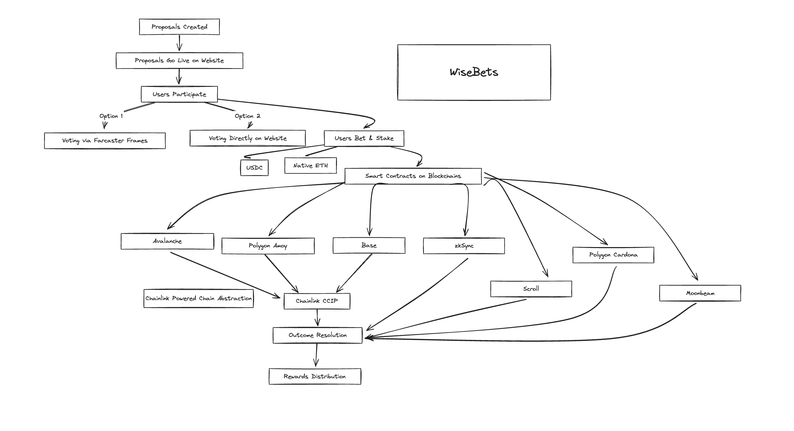

# Welcome to WiseBets 💰

  <a href="https://wisebets.vercel.app">
    
    <h3 align="center">WiseBets</h3>
  </a>

With over 200k monthly active users on Farcaster, we've found the perfect distribution layer to bring WiseBets to the masses! 📈🚀 Whether you're a seasoned crypto enthusiast or just starting your journey, WiseBets makes it easy and fun to participate in the world of decentralized opinion trading.

## Deployed Links

- [Base Sepolia Deployed Contract](https://sepolia.basescan.org/address/0xC21A38478c3412e7253B79E6E1e9Cd3d15F5b73c)
- [Base CCIP Bridge](https://ccip.chain.link/address/0x5EB2E851499Be5Bda359f3316Da43fE4099a1990)

### 🎯 How does it work?

It's simple! We create exciting proposals on various topics, from sports matches to crypto price predictions. All you need to do is choose your side, place your bets using USDC tokens, and wait for the outcome. The more accurate your predictions, the bigger your rewards! 💸

But wait, there's more! WiseBets is breaking down barriers and embracing the power of cross-chain interoperability. Thanks to the amazing Chainlink CCIP, you can now place bets from the Avalanche and Polygon Amoy networks and have your tokens and bets seamlessly transferred. 

WiseBets is also deployed on the zkSync, Scroll, Polygon Cardona and Moonbeam networks, giving you even more opportunities to showcase your prediction skills. As Chainlink CCIP expands its support, we'll be right there, ready to bring you a truly multi-chain opinion trading experience! 🌐💫

### Vision

But WiseBets isn't just about the rewards; it's about shaping the future! 🔮 As we grow, we'll be exploring the exciting concept of Futarchy, where collective wisdom can help guide decision-making on a larger scale. Imagine a world where your opinions not only earn you rewards but also contribute to shaping policies and governance! 🌎🗳️
